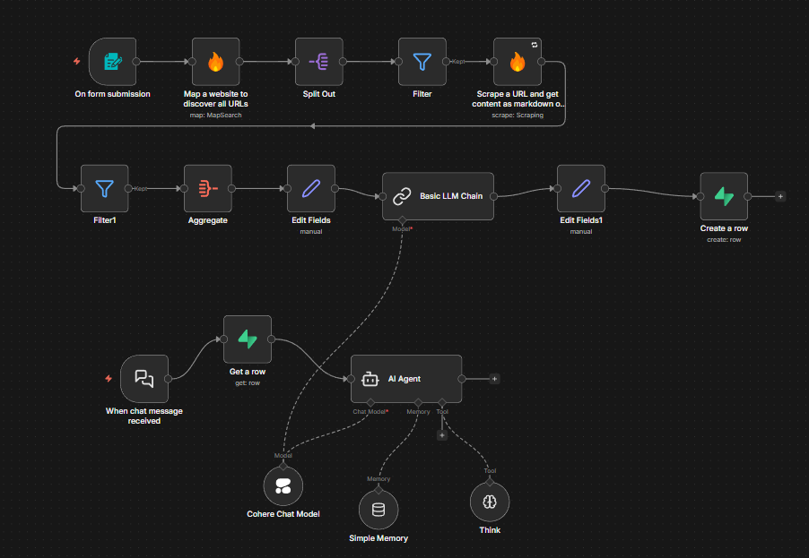

# 🏨 Hotel Support AI Agent  
### Automated Website Scraping → Knowledge Base → AI Support Assistant (n8n)

An end-to-end **AI-powered automation system** built using **n8n**, **LLM agents**, and **web scraping**, designed to convert a **single hotel’s official website** into a structured, persistent **support knowledge system**.

⚠️ **Important:**  
This workflow is intentionally designed for **ONE hotel website at a time** (e.g., a hotel’s official domain).  
It is **NOT intended for aggregator platforms** such as MakeMyTrip, Booking.com, Goibibo, or Airbnb listings.

---

## 🚀 What This Project Does

This automation transforms a **single hotel website** into a reliable AI-powered support agent by:

1. Accepting a **single hotel website URL** via a form trigger  
2. Discovering all **internal pages belonging only to that hotel**
3. Filtering out non-support content (media, gallery, uploads)
4. Scraping and aggregating page content
5. Synthesizing a **deduplicated Support Encyclopedia** using an LLM
6. Persisting hotel knowledge in **Supabase**
7. Serving answers via a **session-aware AI support agent**
8. Enforcing **anti-hallucination constraints**

---

## 🧠 Design Constraint (Very Important)

This system **deliberately rejects multi-hotel or marketplace websites**.

### ✅ Supported Input
- `https://examplehotel.com`
- `https://crowneplazagurgaon.com`
- `https://tajhotels.com/specific-hotel`

### ❌ Not Supported
- MakeMyTrip
- Booking.com
- Agoda
- Airbnb
- Any website containing **multiple hotels or listings**

**Reason:**  
Aggregator websites mix data from multiple properties, which breaks deterministic knowledge synthesis and causes hallucinations.

---

## 🏗️ Architecture Overview

**Technology Stack**
- **n8n** – Workflow orchestration
- **Firecrawl** – Website mapping & scraping
- **Cohere LLM** – Knowledge synthesis & AI responses
- **LangChain nodes** – Agent reasoning & memory
- **Supabase** – Persistent structured knowledge storage

---

## 🧩 Workflow Overview

Below is a screenshot of the complete **n8n workflow**, illustrating website discovery, page filtering, scraping, AI knowledge synthesis, database storage, and the AI support agent layer.

  

---

## 🔄 High-Level Workflow Logic

Single Hotel Website URL
↓
Internal Page Discovery
↓
URL Filtering (Media / Gallery / Uploads)
↓
Page Scraping (Markdown)
↓
Content Aggregation & Deduplication
↓
LLM Knowledge Synthesis
↓
Supabase Knowledge Storage
↓
AI Support Agent (Chat Interface)

## 📌 How to Use

1. Import `Hotel_Scrapping_Automation.json` into n8n  
2. Configure API keys (Firecrawl, Cohere, Supabase)  
3. Submit the **official website of a single hotel**  
4. Query the AI agent with guest-support questions  
